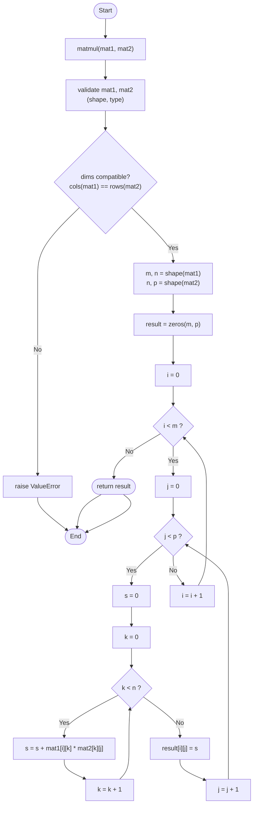

# `matmul` Algorithm — Flowchart

This flowchart visualises the control flow of the pure-Python
`matmul(mat1, mat2)` function in [`src/matmul.py`](../src/matmul.py):
three nested loops (`i`, `j`, `k`) accumulating the dot product of a row
of `mat1` with a column of `mat2` into the result matrix.

**Reading the chart:**
- Rounded nodes = start/end
- Rectangles = processing steps / assignments
- Diamonds = decision points, with the `True`/`False` branch labelled
- The three nested loops (`i`, `j`, `k`) each have their own return edge
  back to their condition check, matching the three `for` loops in the
  implementation.
