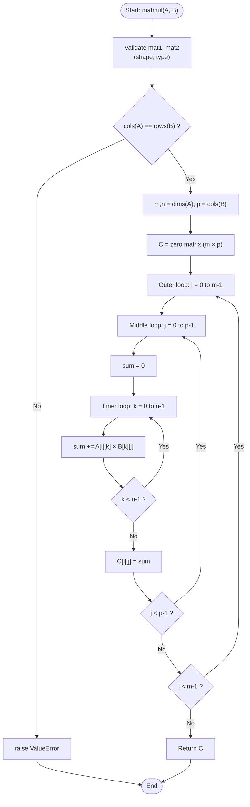

# `matmul` Algorithm — Flowchart

This flowchart visualises the control flow of the pure-Python
`matmul(mat1, mat2)` function in [`src/matmul.py`](../src/matmul.py):
input validation followed by three nested `for` loops (`i`, `j`, `k`)
accumulating the dot product.

![matmul flowchart](https://mermaid.ink/img/Zmxvd2NoYXJ0IFRECiAgICBTdGFydChbIlN0YXJ0OiBtYXRtdWwoQSwgQikiXSkKICAgIFZhbGlkYXRlWyJWYWxpZGF0ZSBtYXQxLCBtYXQyCihzaGFwZSwgdHlwZSkiXQogICAgQ2hlY2tEaW17ImNvbHMoQSkgPT0gcm93cyhCKSA_In0KICAgIFJhaXNlRXJyWyJyYWlzZSBWYWx1ZUVycm9yIl0KICAgIEdldERpbXNbIm0sbiA9IGRpbXMoQSk7IHAgPSBjb2xzKEIpIl0KICAgIEluaXRDWyJDID0gemVybyBtYXRyaXggKG0gw5cgcCkiXQogICAgTG9vcElbIk91dGVyIGxvb3A6IGkgPSAwIHRvIG0tMSJdCiAgICBMb29wSlsiTWlkZGxlIGxvb3A6IGogPSAwIHRvIHAtMSJdCiAgICBJbml0U1sic3VtID0gMCJdCiAgICBMb29wS1siSW5uZXIgbG9vcDogayA9IDAgdG8gbi0xIl0KICAgIERvdFByb2RbInN1bSArPSBBW2ldW2tdIMOXIEJba11bal0iXQogICAgQ2hlY2tLe2sgJmx0OyBuLTEgP30KICAgIFN0b3JlU1siQ1tpXVtqXSA9IHN1bSJdCiAgICBDaGVja0p7aiAmbHQ7IHAtMSA_fQogICAgQ2hlY2tJe2kgJmx0OyBtLTEgP30KICAgIFJldHVybkNbIlJldHVybiBDIl0KICAgIEVuZChbRW5kXSkKCiAgICBTdGFydCAtLT4gVmFsaWRhdGUKICAgIFZhbGlkYXRlIC0tPiBDaGVja0RpbQogICAgQ2hlY2tEaW0gLS0gTm8gLS0-IFJhaXNlRXJyIC0tPiBFbmQKICAgIENoZWNrRGltIC0tIFllcyAtLT4gR2V0RGltcwogICAgR2V0RGltcyAtLT4gSW5pdEMKICAgIEluaXRDIC0tPiBMb29wSQogICAgTG9vcEkgLS0-IExvb3BKCiAgICBMb29wSiAtLT4gSW5pdFMKICAgIEluaXRTIC0tPiBMb29wSwogICAgTG9vcEsgLS0-IERvdFByb2QKICAgIERvdFByb2QgLS0-IENoZWNrSwogICAgQ2hlY2tLIC0tIFllcyAtLT4gTG9vcEsKICAgIENoZWNrSyAtLSBObyAtLT4gU3RvcmVTCiAgICBTdG9yZVMgLS0-IENoZWNrSgogICAgQ2hlY2tKIC0tIFllcyAtLT4gTG9vcEoKICAgIENoZWNrSiAtLSBObyAtLT4gQ2hlY2tJCiAgICBDaGVja0kgLS0gWWVzIC0tPiBMb29wSQogICAgQ2hlY2tJIC0tIE5vIC0tPiBSZXR1cm5DCiAgICBSZXR1cm5DIC0tPiBFbmQ=)

> **Tip**: The image above is rendered by [mermaid.ink](https://mermaid.ink). The Mermaid source code is preserved below for local editing (VS Code with Mermaid extension, Jupyter Notebook, etc.).

**Reading the chart:**
- Rounded nodes = start/end
- Rectangles = processing steps / assignments
- Diamonds = decision points (`Yes`/`No` branches explicitly labelled)
- Each `for` loop checks the termination condition **after** executing its
  body (`k < n-1?`, `j < p-1?`, `i < m-1?`), with the loop variable
  increment implied in the return edge back to the loop header.
