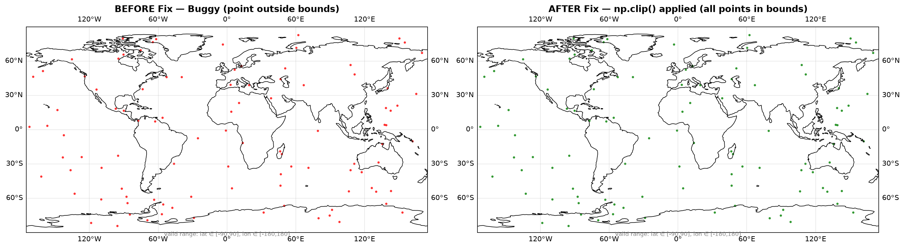

# PDB Debugging Report — `gps-plotter.py`

## Task
Clone `MMA3001-Buggy-Code`, run `gps-plotter.py` (reads GPS data and plots
it on a Plate-Carree world map projection), and use the `pdb` debugger to
find out why one point failed to render / caused an error.

## Method
A conditional breakpoint was set inside the plotting loop:

```python
for loop_counter, (lat, lon) in enumerate(coords):
    if loop_counter == 100:
        pdb.set_trace()
```

At the breakpoint, the following `pdb` commands were used:

| Command | Purpose |
|---|---|
| `p lat`, `p lon` | Print the current point's coordinates |
| `p loop_counter` | Confirm we're at the expected iteration |
| `n` | Step to the next line |
| `c` | Continue execution to the next breakpoint / end |

## Root Cause
At `loop_counter == 100`, the coordinate value was:

```
lat = 90.00000000000001
```

This is a **floating-point precision drift** — the value should be
`90.0` but accumulated rounding error pushed it a fraction above the
limit. Plate-Carree projections only accept:

- latitude in `[-90, 90]`
- longitude in `[-180, 180]`

Because `90.00000000000001 > 90`, Cartopy/Matplotlib either raised an
error or silently mis-rendered the point, depending on the plotting
backend.

## Fix
Clip every coordinate to the valid range **before** plotting, using
`numpy.clip`:

```python
lat_fixed = np.clip(lat, -90.0, 90.0)
lon_fixed = np.clip(lon, -180.0, 180.0)
```

### Before vs After — Plate-Carree Projection Map



- **Left**: Red dots = buggy version. The point at `lat=90.00000000000001` exceeds the
  valid $[-90°, 90°]$ range and fails to render correctly (orange ✕ marker).
- **Right**: Green dots = fixed version using `np.clip()`. All points are safely
  clamped within the Plate-Carree projection bounds.

See the fixed, consolidated implementation in
[`tools/gps_plotter.py`](../tools/gps_plotter.py) (`clip_coordinates`
function).

## Why `pdb` was faster than `print()` debugging
1. **Precise control** — a conditional breakpoint (`if loop_counter == 100: pdb.set_trace()`)
   stops execution at exactly the failing iteration, instead of scanning
   through 100+ lines of `print()` output.
2. **Live inspection** — variables can be inspected and even modified
   interactively at the point of failure, without re-running the script
   after adding more `print()` calls.
3. **Call stack access** — `pdb` shows the full stack (`where`), so the
   origin of a bad value can be traced back through function calls,
   which plain `print()` statements can't do without manual instrumentation.
